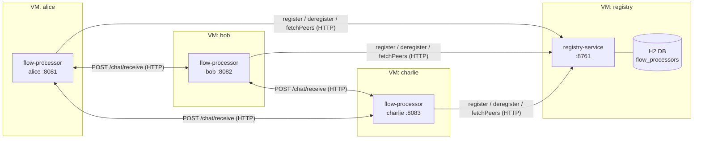
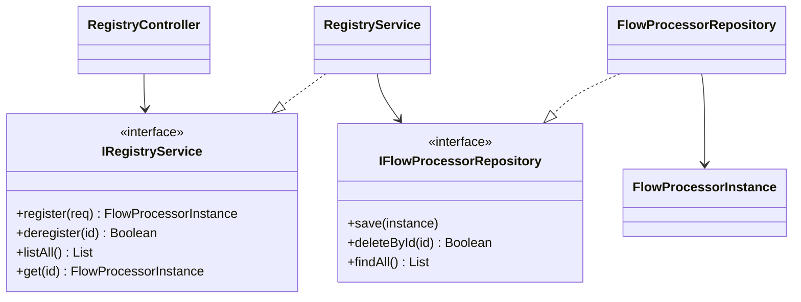
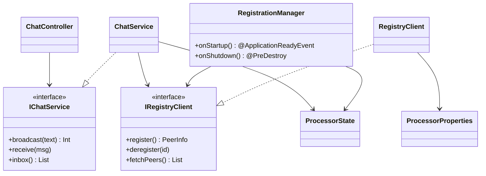

# SPLSD-35 — Chat cu coregrafie și registru de servicii

> Pornind de la aplicația de **chat din Laboratorul 8**, sistemul este restructurat:
> brokerul central `MessageManager` (orchestrare) este **înlocuit** cu un **registru de
> servicii** (microserviciu web cu bază de date, accesat prin HTTP), iar nodurile de chat
> devin **procesoare de flux** care se **înregistrează** la pornire, se **șterg** la oprire
> și comunică **peer-to-peer prin HTTP** — adică prin **coregrafie** (fără coordonator central).

---

## 1. Ce cere enunțul și cum este rezolvat

| Cerința din enunț | Cum este rezolvată |
|---|---|
| Pornind de la **chat-ul din Lab 8** | Nodurile de chat (fostele Teacher/Student) devin **procesoare de flux** identice și interschimbabile |
| **Procesor de flux** cu **mecanism de tip registru** (se înregistrează la pornire, se șterge la distrugere) | `flow-processor` se înregistrează în `ApplicationReadyEvent` și se șterge în `@PreDestroy` (vezi `RegistrationManager.kt`) |
| **Microserviciu web cu bază de date**, comunicare prin **HTTP** | `registry-service` = Spring Boot Web + bază de date **H2**, API REST `/processors` |
| Se pot crea **oricâte servicii** | Pornești oricâte instanțe de `flow-processor` (alice, bob, charlie, ...) — fără modificări de cod |
| Fiecare microserviciu **în mașina lui virtuală** | Fiecare serviciu rulează în propriul **container Docker** (`docker-compose.yml`) |
| **Coregrafie** | Nu există orchestrator: fiecare procesor își descoperă singur colegii din registru și trimite mesajele direct, peer-to-peer |
| **SOLID** (microservicii + clase) | Vezi secțiunea [6. SOLID](#6-respectarea-principiilor-solid) |

### De la Laboratorul 8 la SPLSD-35

```
LAB 8 (orchestrare):                    SPLSD-35 (coregrafie):

  Teacher ──► MessageManager ──► Student     alice ◄────► bob
                  (broker                       ▲   ╲    ╱  ▲
               central care                     │    ╲  ╱   │   mesaje DIRECTE
               rutează tot)                     ▼     ╳     ▼   (peer-to-peer, HTTP)
                                             charlie ◄─────►
                                                │     │     │
                                                ▼     ▼     ▼
                                            ┌─────────────────┐
                                            │  registry-service│  ← doar DESCOPERIRE
                                            │  (web + H2 DB)   │    (nu rutează mesaje)
                                            └─────────────────┘
```

Diferența esențială: în Lab 8, `MessageManager` **decidea** unde merge fiecare mesaj
(orchestrare). Aici, registrul este un simplu **director**; fiecare procesor de flux
**decide singur** ce face cu mesajele (coregrafie).

---

## 2. Arhitectura serviciilor (diagrama de servicii)



Două tipuri de microservicii:

- **`registry-service`** (1 instanță) — microserviciul web cu bază de date. Ține evidența
  procesoarelor active. Nu cunoaște nimic despre chat.
- **`flow-processor`** (N instanțe) — procesorul de flux / nodul de chat. Se înregistrează,
  descoperă colegii și schimbă mesaje cu ei.

---

## 3. Diagrama de clase (pe fiecare serviciu)

### registry-service



Straturi: **Controller (HTTP)** → **Service (business)** → **Repository (bază de date / JdbcTemplate)**.

### flow-processor



---

## 4. Cum rulezi — Varianta A: în IntelliJ IDEA (recomandat pentru dezvoltare)

1. **Deschide proiectul**: `File ▸ Open` și selectează folderul `ttttttttttttttt`
   (cel care conține `pom.xml`-ul părinte). IntelliJ recunoaște proiectul Maven multi-modul
   și descarcă dependențele automat. Dacă te întreabă, alege **Trust Project**.
2. **Setează SDK-ul**: `File ▸ Project Structure ▸ Project ▸ SDK` → un **JDK 8+**
   (dacă nu ai, IntelliJ îl poate descărca din același meniu: `Add SDK ▸ Download JDK`).
3. **Pornește registrul**: deschide
   `registry-service/.../RegistryApplication.kt` și apasă ▶ (Run) pe funcția `main`.
   Pornește pe **http://localhost:8761**.
4. **Pornește 2–3 procesoare de flux**. Aici folosești aceeași clasă `FlowProcessorApplication`
   de mai multe ori, cu parametri diferiți. Pentru fiecare instanță, creează o configurație
   de rulare (`Run ▸ Edit Configurations ▸ + ▸ Application`, Main class
   `com.sd.laborator.processor.FlowProcessorApplicationKt`) și pune la **Environment variables**:

   | Instanță | Environment variables |
   |---|---|
   | alice   | `PORT=8081;PROCESSOR_NAME=alice;PROCESSOR_HOST=localhost;REGISTRY_URL=http://localhost:8761` |
   | bob     | `PORT=8082;PROCESSOR_NAME=bob;PROCESSOR_HOST=localhost;REGISTRY_URL=http://localhost:8761` |
   | charlie | `PORT=8083;PROCESSOR_NAME=charlie;PROCESSOR_HOST=localhost;REGISTRY_URL=http://localhost:8761` |

   > Sfat IntelliJ: bifează `Modify options ▸ Allow multiple instances` ca să poți rula
   > simultan mai multe procesoare.

5. **Testează**: deschide `demo.http` și rulează cererile (sau folosește comenzile din
   secțiunea 7). Vei vedea în consolele procesoarelor mesajele primite.
6. **Oprește un procesor** (butonul roșu Stop): observă în consola registrului că s-a
   **șters automat** din registru (`@PreDestroy`).

---

## 4bis. Cum rulezi — Varianta B: din linia de comandă (Maven)

```bash
# din folderul ttttttttttttttt
mvn clean package                  # compileaza ambele module

# terminal 1 – registrul
java -jar registry-service/target/registry-service-1.0.0.jar

# terminal 2 – alice
set PORT=8081& set PROCESSOR_NAME=alice& set REGISTRY_URL=http://localhost:8761
java -jar flow-processor/target/flow-processor-1.0.0.jar

# terminal 3 – bob   (PORT=8082, PROCESSOR_NAME=bob)
# terminal 4 – charlie (PORT=8083, PROCESSOR_NAME=charlie)
```

---

## 5. Cum rulezi — Varianta C: Docker (fiecare microserviciu în mașina lui virtuală)

Aceasta este varianta care respectă cerința „fiecare microserviciu în mașina lui virtuală”.

```bash
# din folderul ttttttttttttttt
docker compose up --build       # porneste registry + alice + bob + charlie

# ... testezi (vezi sectiunea 7) ...

docker compose down             # opreste tot; procesoarele se sterg din registru
```

Fiecare serviciu rulează izolat, în containerul lui, și se descoperă reciproc prin numele
de container pe rețeaua Docker (`PROCESSOR_HOST=alice`, `REGISTRY_URL=http://registry:8761`).

---

## 6. Respectarea principiilor SOLID

### La nivel de microservicii

- **SRP** — `registry-service` are o singură responsabilitate (descoperirea serviciilor);
  `flow-processor` are o singură responsabilitate (chat + propriul ciclu de viață).
- **OCP / extensibilitate** — adaugi oricâte procesoare de flux **fără să modifici** nimic
  existent; sistemul se extinde prin adăugare, nu prin modificare.
- **DIP** — procesoarele nu depind unul de altul direct; depind de **abstracția** „registru”
  prin care se descoperă. Cuplaj slab, comunicare prin HTTP.

### La nivel de clase (în interiorul fiecărui serviciu)

- **S** (Single Responsibility): `Controller` (doar HTTP) ≠ `Service` (doar business) ≠
  `Repository`/`RegistryClient` (doar I/O) ≠ `RegistrationManager` (doar ciclul de viață).
- **O** (Open/Closed): se pot adăuga implementări noi de `IChatService` / `IRegistryClient`
  fără a schimba controller-ele.
- **L** (Liskov): orice implementare poate înlocui interfața ei (`RegistryService` ↔
  `IRegistryService`, `RegistryClient` ↔ `IRegistryClient`) fără a strica apelantul.
- **I** (Interface Segregation): interfețe mici și la obiect — `IRegistryClient` are exact
  3 metode (`register`, `deregister`, `fetchPeers`), nimic în plus.
- **D** (Dependency Inversion): clasele depind de **interfețe**, iar Spring injectează
  implementările concrete (constructor injection peste tot).

---

## 7. API și comenzi de test rapide

### registry-service (`:8761`)

| Metodă | Endpoint | Descriere |
|---|---|---|
| `POST` | `/processors` | înregistrează un procesor (`{name, host, port, type}`) |
| `DELETE` | `/processors/{id}` | șterge un procesor |
| `GET` | `/processors` | listează toate procesoarele (`?type=...` opțional) |
| `GET` | `/processors/{id}` | detaliile unui procesor |
| — | `/h2-console` | consola bazei de date (demonstrație) |

### flow-processor (`:8081`, `:8082`, `:8083`)

| Metodă | Endpoint | Descriere |
|---|---|---|
| `POST` | `/chat/send` | difuzează un mesaj către toți (`{text}`) |
| `POST` | `/chat/receive` | primește un mesaj (apelat de alt procesor) |
| `GET` | `/chat/inbox` | mesajele primite |
| `GET` | `/chat/whoami` | identitatea proprie din registru |

### Exemplu (curl / PowerShell)

```bash
# cine e inregistrat
curl http://localhost:8761/processors

# alice trimite un mesaj tuturor
curl -X POST http://localhost:8081/chat/send -H "Content-Type: application/json" -d "{\"text\":\"Salut!\"}"

# ce a primit bob
curl http://localhost:8082/chat/inbox
```

---

## 8. Structura proiectului

```
ttttttttttttttt/
├── pom.xml                      # POM parinte (multi-modul, Spring Boot 2.3.12, Kotlin 1.6.0)
├── docker-compose.yml           # ruleaza registry + alice + bob + charlie, fiecare in VM-ul lui
├── demo.http                    # cereri de test pentru IntelliJ HTTP Client
│
├── registry-service/            # microserviciul de registru (web + baza de date H2)
│   ├── pom.xml
│   ├── Dockerfile
│   └── src/main/
│       ├── kotlin/com/sd/laborator/registry/
│       │   ├── RegistryApplication.kt
│       │   ├── controller/RegistryController.kt
│       │   ├── service/IRegistryService.kt + RegistryService.kt
│       │   ├── repository/IFlowProcessorRepository.kt + FlowProcessorRepository.kt
│       │   ├── model/FlowProcessorInstance.kt
│       │   └── dto/RegistrationRequest.kt
│       └── resources/
│           ├── application.yml
│           └── schema.sql       # tabela flow_processors
│
└── flow-processor/              # procesorul de flux / nodul de chat
    ├── pom.xml
    ├── Dockerfile
    └── src/main/
        ├── kotlin/com/sd/laborator/processor/
        │   ├── FlowProcessorApplication.kt
        │   ├── controller/ChatController.kt
        │   ├── service/IChatService.kt + ChatService.kt
        │   ├── registry/IRegistryClient.kt + RegistryClient.kt
        │   ├── lifecycle/RegistrationManager.kt   # inregistrare/stergere (registru)
        │   ├── state/ProcessorState.kt
        │   ├── config/ProcessorProperties.kt + AppConfig.kt
        │   ├── model/PeerInfo.kt + ChatMessage.kt
        │   └── dto/SendMessageRequest.kt + RegistrationRequest.kt
        └── resources/application.yml
```

---

## 9. Idei de discuție pe cod (pentru prezentare)

- **Coregrafie vs. orchestrare**: arată că nu există niciun punct central care „comandă"
  fluxul — fiecare `flow-processor` decide singur (în `ChatService.broadcast`).
- **Mecanismul de registru**: `RegistrationManager` (înscriere la `ApplicationReadyEvent`,
  ștergere la `@PreDestroy`) + persistența în H2 prin `FlowProcessorRepository`.
- **Toleranță la defecte**: dacă un peer e oprit, `broadcast` prinde excepția și continuă cu
  ceilalți — sistemul nu pică din cauza unui singur nod.
- **Independența serviciilor**: fiecare în containerul lui, descoperire prin registru,
  comunicare exclusiv prin HTTP.
